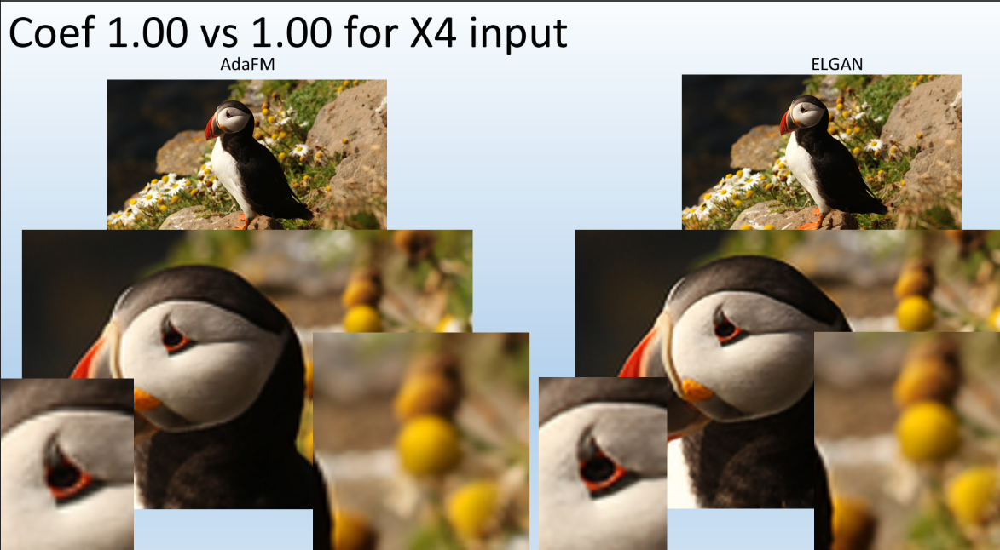

# Modulating Image Restoration with GAN archticture via Adaptive Feature Modification Layers

Jingwen He, [Chao Dong](https://scholar.google.com.hk/citations?user=OSDCB0UAAAAJ&hl=en), and [Yu Qiao](http://mmlab.siat.ac.cn/yuqiao/) represent image restoration with continual levels via adaptive feature modification layers [paper](https://arxiv.org/abs/1904.08118) . 

SuperResolution on convolutional networks, the interpolation to go from high to low resolution levels is simple.
The problem lies when you want to go from low to high resolution, so a wider precision of the pixels and a new "creation" of pixels is needed.
Convolutional networks are difficult for them in this task and therefore esrgan's architecture can adapt to the transition from low resolution to high resolution.

I and [Harel Keller](https://github.com/harel12k) took the ESRGAN network and plugin the AdaFM block as cakked ELGAN on the network
it can be seen that there is an improvement in the transition from low resolutions to high resolutions. 
<p align="center">
  
</p>


### Dependencies

- Python 3 (Recommend to use [Anaconda](https://www.anaconda.com/download/#linux))
- [PyTorch >= 0.4.0](https://pytorch.org/)
- NVIDIA GPU + [CUDA](https://developer.nvidia.com/cuda-downloads)
- Python packages: `pip install numpy opencv-python lmdb`
- [option] Python packages: [`pip install tensorboardX`](https://github.com/lanpa/tensorboardX), for visualizing curves.

# Pretrained models
We provide a pretrained model for AdaFM-Net ([`experiments/pretrained_models`](experiments/pretrained_models)) that deals with denoising from σ15 to σ75. Please run the following commands directly:
```c++
cd codes
python interpolate.py -opt options/test/test.json
```
The results can be found in the newly created directory `AdaFM/results` 
The noise level of the [`input image`](datasets/personal_images/personal_images_noise45/soilder.png) is σ45, and you are supposed to obtain similar interpolated results as follows:

<p align="center">
  
</p>

# Codes
The overall code framework mainly consists of four parts - Config, Data, Model and Network.
We also provides some useful scripts. 
Please run all the following commands in “codes” directory.

## How to Test

### basic model and AdaFM-Net
1. Modify the configuration file [`options/test/test.json`](codes/options/test/test.json) (please refer to [`options`](codes/options) for instructions.)
1. Run command:
```c++
python test.py -opt options/test/test.json
```

### modulation testing
1. Modify the configuration file [`options/test/test.json`](codes/options/test/test.json) 
1. Run command:
```c++
python interpolate.py -opt options/test/test.json
```
#### or:
1. Use [`scripts/net_interp.py`](codes/scripts/net_interp.py) to obtain the interpolated network.
1. Modify the configuration file [`options/test/test.json`](codes/options/test/test.json) and run command: `python test.py -opt options/test/test.json`

## How to Train

### basic model
1. Prepare datasets, usually the DIV2K dataset. More details are in [`codes/data`](codes/data). 
1. Modify the configuration file [`options/train/train_basic.json`](codes/options/train/train_basic.json) (please refer to [`options`](codes/options) for instructions.)
1. Run command: 
```c++
python train.py -opt options/train/train_basic.json
```
### AdaFM-Net
1. Prepare datasets, usually the DIV2K dataset.
1. Modify the configuration file [`options/train/train_adafm.json`](codes/options/train/train_adafm.json)
1. Run command:
```c++
python train.py -opt options/train/train_adafm.json
```

### ELGAN-Net
1. Prepare datasets, usually the DIV2K dataset.
1. Modify the configuration file [`options/train/train_gan.json`](codes/options/train/train_gan.json)
1. Run command:
```c++
python train.py -opt options/train/train_gan.json
```
## Acknowledgement

- This code borrows heavily from [AdaFM](https://github.com/hejingwenhejingwen/AdaFM).
